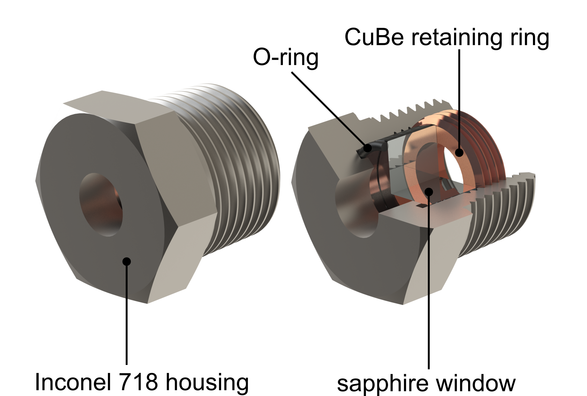

# Furnace Design

## Chamber

The main structural component of the high-pressure laser floating zone setup, designed by Michael Aling, is the inconel pressure chamber. It is made of nickel alloy 718 and was machined in the UCSB Physics Machine Shop by Andy Segale. Inconel 718 is an extremely strong and corrosion resistant alloy employed in the aerospace industry to design jet engine components which have to sustain the most demanding environments, including extremely high temperatures, pressures and oxidizing environments. It can be machined in its softened state and then precipitation hardened. After machining was completed at UCSB, the chamber was precipitation hardened by Solar Atmospheres of California (www.solaratm.com) who have the required equipment as well as extensive knowledge on heat treatment of specialized metal alloys.

The chamber is equipped with seven ¾" NPT ports. These are for the windows which allow for the laser beam to penetrate into the chamber, and can be used to image the molten sample using semi-transparent mirrors which reflect out-of-plane lasers into the chamber.

Threaded into these window ports are custom sight glasses which fetaure a replaceable, anti-reflection coated window which is held in place by an O-ring and a retaining ring of CuBe alloy UNSC17200, chosen for its corrosion resistance. The sight glass housings are made from Inconel 718.

{width="400"}

## Pressure sealing 
The chamber can be attached to the drives via adapting pieces, also designed by Michael Aling and machined out of the Inconel 718 alloy. The reason for these adapting pieces is the following. The drives are sealed to the processing chamber via a coned high pressure metal-to-metal seal. This is machined directly into the end of the drive ends and cannot easily be replaced. Since a seal will have to be broken each time the sample is mounted / unmounted, a replaceable seal is paramount. We therefore designed an adapting piece which is permanently sealed to the drives via the coned seals. The adaptors in turn are sealed to the chamber via replaceable metal gasket seals, detailed in [Sealing the Chamber](/docs/sops/sealing.md).

## Water cooling

The chamber is water-cooled – this is essential since otherwise it would get extremely hot which would severely compromise its structural integrity and resistance to oxidation, and high temperatures have been shown to melt the O-rings in the window housings and cause damage to the sapphire windows. It is therefore also equipped with several thermocouple ports in order to monitor the chamber temperature during growth runs.

## Structural Frame

The chamber is directly attached to the linear guide shafts via a set of brackets. These were custom machined by the engineering machine shop according to designs by Michael Aling.

An important note is regarding the general build of the setup. All components are attached directly or indirectly to the linear guide shafts which run the length of the instrument. The main attachment point is the chamber itself. Via its brackets it is attached to the guide shafts using face-mounted shaft collars ([McMaster](https://www.mcmaster.com/catalog/129/1438/9677T2)) which are tightened to the guide shafts. All other parts are now attached to the chamber itself. The reason for this design decision was to help with alignment - by having all other parts floating they have the required tolerance to self-align with the chamber.

