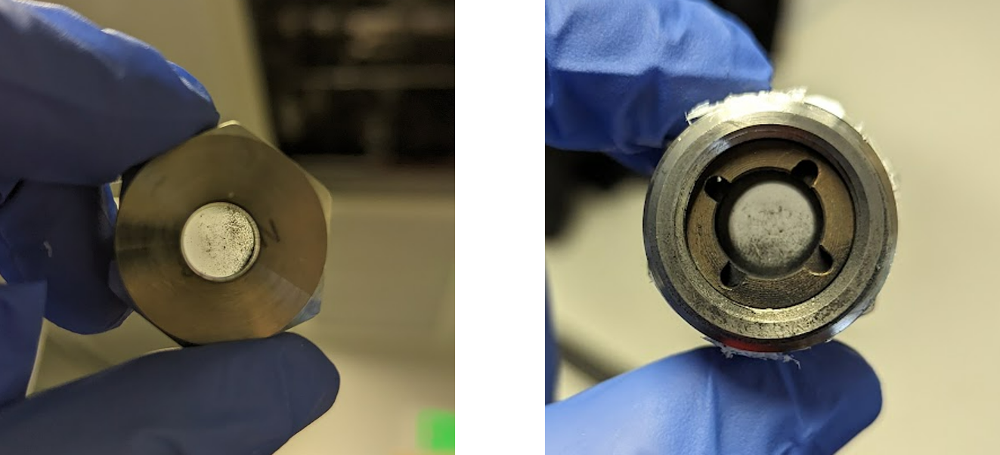
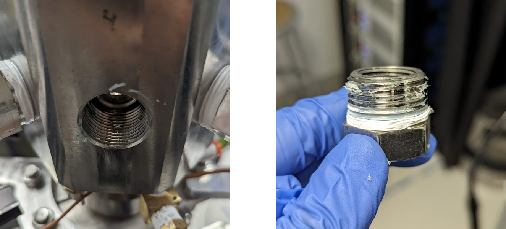
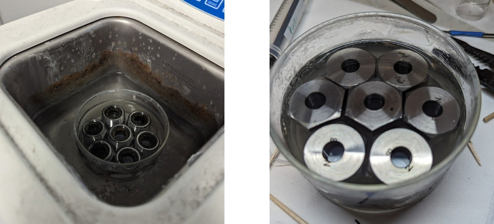
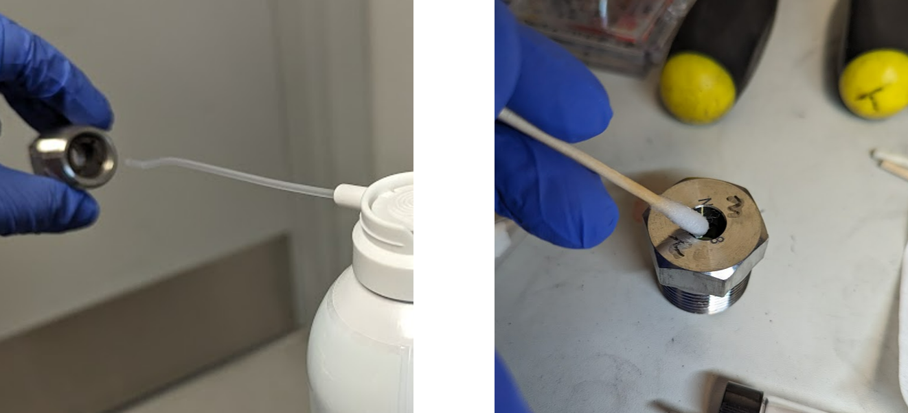
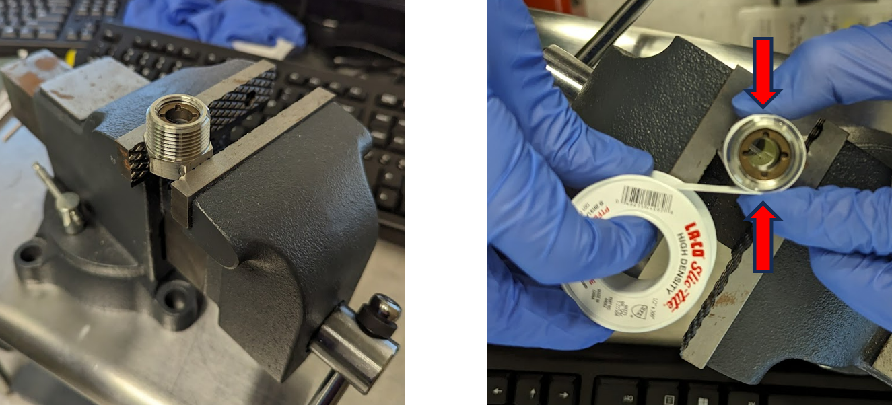
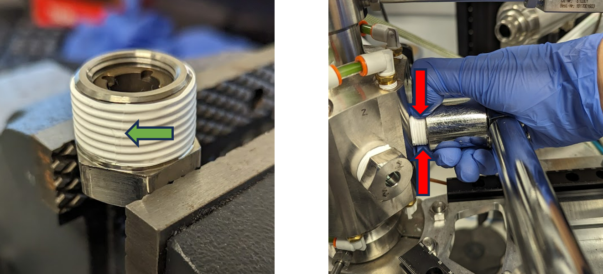

# Installing new chamber windows

Volatility will build up on the interior face of the sapphire window. It is important to clean this quarterly to avoid heating the sapphire to its melting point.

1. Remove window housing from chamber. Clean threads using a non-abrasive brush (like a dish scrubber).
    
2. Sonicate the windows using a solvent like IPA or EtOH. Ensure there are no bubbles trapped underneath – this will prevent powder from being sonicated off.
    
4. Use compressed gas to thoroughly dry the window housing. Use a wet cotton swab to ***gently*** clean residue off the front and back faces of the sapphire. Repeat with a fresh cotton swab, until streak-free.
    
4. Place window housing in vice. Apply oxygen-safe Teflon tape around the threads ***clockwise*** until it has been wrapped 3 full turns. While you wrap, firmly press the Teflon to the threads with your fingers (red arrows) and maintain a constant, gentle tension on the tape to improve adhesion. When finished, the “tail” of the Teflon should be pointing left (green arrow).
    
5. Tighten to 50 ft-lbs, keeping constant force on Teflon using fingers to prevent slipping (red arrows).
    
6. Pressurize chamber to the max pressure, but pause every 1,000 psi and use leak checking fluid (like Snoop) around the threads. You can also try to form a bubble around the hole in the center to see if there is a leak from the sapphire/O-ring assembly, but you must be careful not to allow the fluid to dirty the sapphire.