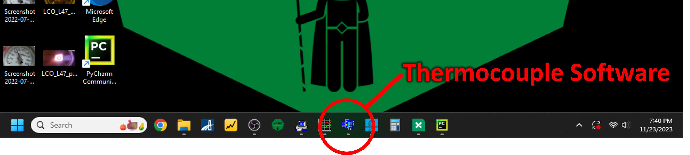
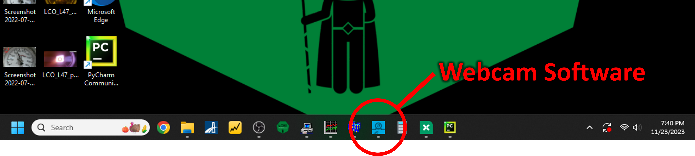
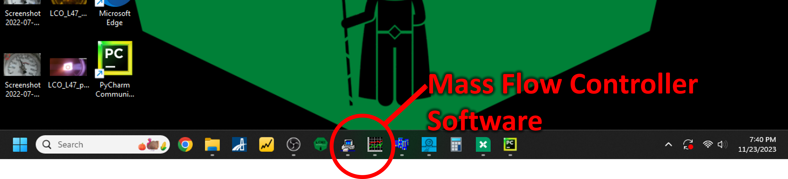

# Startup guide
**Purpose**: A reference to be used *each and every time* by experienced users of the furnace.

---

## Section I: Turning on equipment
1. Create a new Growth Log in the "[Growth Logs](https://drive.google.com/drive/folders/1A3_43n8ItInI4Z7pf4uCt52mfkHWRzl-?usp=drive_link)" folder in the [LOKII Google Drive](https://drive.google.com/drive/folders/1-5bD7GNJCqUvJMFQOrpgeaQlDUMaeCdf?usp=drive_link).    

1. On the front of each of the seven laser units, turn the key clockwise to the "ON" position.
    {width=400}

1. On the front of the translator control unit, flip the power switch on the top right.
   

1. On Computer 1, open the camera software, Pylon Viewer ([more info]())
   

1. On Computer 1, open the pyrometer software, DataTemp MultiDrop ([more info]())
   

1. On Computer 2, open the thermocouple software, DP1001 AM ([more info]())
   

1. On Computer 2, open the Laser Controller Software ([more info]())
   

1. On Computer 2, open the webcam software to monitor the pressure gauge, Logitech Camera Settings ([more info]())
   

1. On Computer 2, open the mass flow controller software, FlowDDE and FlowPlot ([more info]())
   

---

## Section II: Loading your sample
1. Slide the bottom translator housing downward.

1. Clean all four sealing surfaces (top translator, top of chamber, bottom of chamber, and bottom translator) using a Kimwipe and IPA/EtOH. ([more info]())

1. Use an air duster to blow away the Kimwipe fibers off the sealing surfaces.

1. Place one seal ring on the top of the chamber, and one seal ring on the bottom translator. ([more info]())

1. Gently drop the shroud cup into the bottom translator, followed by a shaft collar (without set screw). ([more info]())

1. Position a collar on the bottom translator shaft, about 2 cm below the tip, and secure using the set screw.

1. Add an alumina washer on top of the collar.

1. Mount the seed rod in the seed rod holder and minimize precession. ([more info]())

1. Place the seed rod holder on the bottom translator shaft, and secure using the set screw.

1. Carefully slide the lower shroud piece over the seed rod (it may be necessary to translate the shaft downward at this point) and down into the translator to mate with the shroud cup. Rotate the lower shroud piece until the hole on the side is facing the gas outlet.

1. Place the shroud window on top of the lower shroud.

1. Carefully raise the lower translator housing upward until it is flush with the bottom of the chamber.

1. Carefully lower the top shroud piece into the chamber until it rests on the shroud window.

1. Mount the feed rod in the feed rod holder. ([more info]())

1. Measure the length of the mounted feed rod and record it in the Growth Log.

1. Attach an alumina washer and shaft collar to the upper translator shaft, about 2 cm above the tip.

1. Attach another alumina washer and the upper half of the feed rod holder to the upper translator shaft.

1. Slide the upper translator down until it is flush with the top of the chamber. Be careful not to collide the feed and seed rods!

1. Install the lower and upper clamps, and torque the bolts to 23 ft-lbs. ([more info]())

---

## Section III: Pressurizing the chamber

### If using Ar  or N$_2$

1. Close all low-pressure valves, including the mass flow controller (using FlowPlot software, set flowrate to `0.0`). ([more info]())

1. Open the gas bottle in room 3232 (gowning room).

1. Open valves downstream of the gas bottle, up to the vent valve.
   

1. Using the FlowPlot software, flow gas to vent valve at the flowrate specified below, in order to flush out any oxygen in the low pressure piping. Flow for 5 minutes. ([more info]())
      - **Ar**: Setpoint = 50% (Flowrate = 5 SLPM)
      - **N$_2$**: Setpoint = 65% (Flowrate = 5 SLPM)

1. Open valves upstream of the getter.

1. Open valves downstream of the getter to vent valve. Be cautious as the getter may be pressurized as much as 1,000 psi.

1. Open all valves downstream of the vent valve to the chamber outlet.

1. Close the vent valve, and the gas should begin flowing into the chamber and out of the chamber outlet piping.

1. Turn on the compressor at a very slow rate in order to flush out any residual oxygen. ([more info]())

1. Close the chamber outlet valves and the chamber will begin pressurizing. Pressurize up to 200 psi, then close the chamber inlet needle valve.

1. Purge the chamber by opening the outlet ball valve followed by carefully opening the outlet needle valve. Let the pressure drop to just above zero, but do not allow the pressure to reach exactly zero.

1. Close the chamber outlet valves once again, and carefully open the chamber inlet needle valve.

1. Repeat these steps (pressurize to 200 psi and purge) at least 3 times.

1. Open the chamber outlet valves and continue to allow gas to flow through the chamber and out of the outlet for these next few steps.

1. Next, dry the feed rod. To do so, turn on the laser emission, and raise the power until the rod begins to glow, without melting it. Translate the rod relatively fast (upwards of 100 mm/hr) through the laser beam to remove any residual moisture. ([more info]())

1. Turn off the laser emission.

1. Bring the feed and seed rods back to their starting positions.

1. Close the chamber outlet valves, and the chamber will begin pressurizing. Allow the chamber to reach the bottle pressure (usually around 1,200 psi), or the desired pressure, whichever is lower.

1. If the desired pressure is higher than the bottle pressure, turn on the compressor until the desired pressure is reached. ([more info]())

### If using 80:20 Ar:O$_2$

1. Close all low-pressure valves, including the mass flow controller (using FlowPlot software, set flowrate to `0.0`). ([more info]())

1. Open the gas bottle in room 3232 (gowning room).

1. Open all valves downstream of the gas bottle, up to the mass flow controller.

1. Open all valves downstream of the mass flow controller to the chamber outlet.

1. Using the FlowPlot software, set gas flowrate to desired value. Gas should begin flowing into the chamber and out of the chamber outlet piping.

1. Close the chamber outlet valves and the chamber will begin pressurizing.

1. Allow the chamber to reach the bottle pressure (usually around 1,200 psi), or the desired pressure, whichever is lower.

1. If the desired pressure is higher than the bottle pressure, turn on the compressor until the desired pressure is reached. ([more info]())

---

## Section IV: Setup static gas pressure or gas flow
**If using static pressure**, close chamber inlet valves and move on to the next section.

**Otherwise, if using gas flow**, leave chamber inlet valves open and refer to the following steps:

1. Turn on the compressor and set it to a slow rate. Loosen the pressure limiter just until the limit is reached (a whistle-like noise should sound).

1. Close the inlet needle valve.

1. With the outlet needle valve closed, open the outlet ball valve.

1. Carefully open the outlet needle valve to allow a small flow.

1. Carefully open the inlet needle valve to allow a small flow.

1. Balance the outlet and inlet needle valve until a desired equilibrium is reached.

---
## Section V: Begin growth

1. Bring the feed and seed rods to their starting positions.

1. Focus and align the camera and pyrometer on the seed rod. ([more info]())

1. Place the notch filter in front of the pyrometer. ([more info]())

1. Slide a neutral density filter in front of the camera, if desired. ([more info]())

1. Place the laser safety sign on the outside of the door.

1. Close the laser curtains.

1. Press the green "Start" button on the front of each laser unit to enable emission. ([more info]())

1. Enable communication with all seven lasers in the Laser Controller Software.

1. Start the pyrometer Data Recorder. ([more info]())
   
1. Start the screen recorder. ([more info]())

1. Begin growth! ([more info]())
