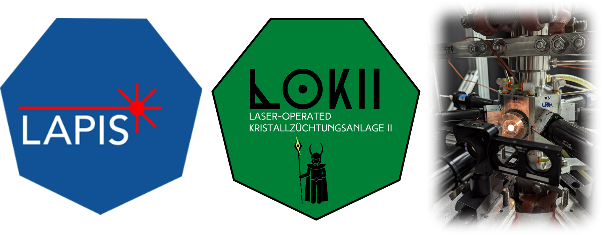

  

# Welcome to the High-Pressure Laser Floating Zone Lab Documentation!

---

## Brief overview
The high-pressure laser floating zone furnaces enable bulk single crystal growth of a wide variety of volatile and metastable phases, at pressures up to 1,000 bar using N$_2$, Ar, and O$_2$ gas environments. For more details about the furnace capabilities, see the publications for the furnace designs, [first-generation](https://pubs.aip.org/aip/rsi/article/90/4/043906/283212/High-pressure-laser-floating-zone-furnace) and [second-generation](https://pubs.aip.org/aip/rsi/article-abstract/95/3/033903/3268529/Advances-in-high-pressure-laser-floating-zone?redirectedFrom=fulltext).

## About this website
This website provides information relevant to user orientation, serves as a quick reference guide for returning users, and serves as a knowledgebase for maintenance information and known issues. 
