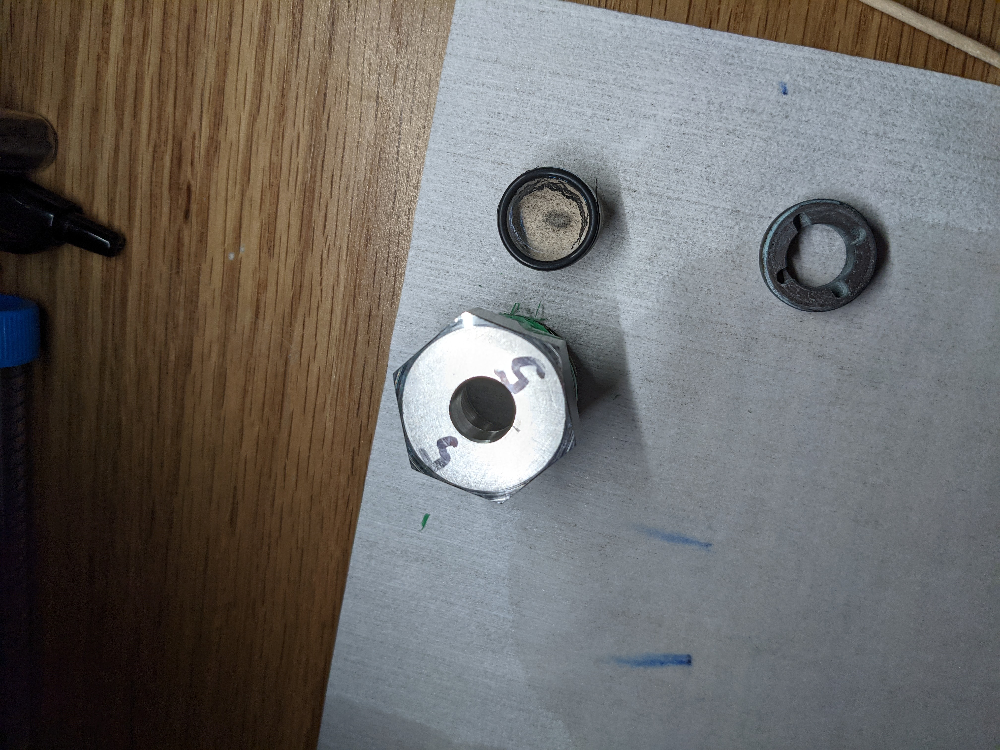

# Maintenance
These operations are more advanced than is typical for the average user, and generally should be performed with caution.

## Laser Optics
### Focusing the beam
### Aligning the beam
## Translators
### Aligning the adapter pieces
### Aligning the sealing surface
### Issues with translation speed
## Chamber
### Installing new windows
### Melting of O-rings

### Preparing a new chamber
### Deep cleaning the chamber
### Leak checking the chamber
## Chiller
### Antibioloical treatment
### Replacing the cooling water
## Cooling lines
### Repairing the cooling lines
## Gas manifold
### Replacing the gas bottle
### Swagelok tubing (low-pressure)
### Maxpro tubing (high-pressure)
### Leak checking
## Compressor 
### Repairing the pressure seals
## Structural frame
### Positioning / aligning the chamber
### Counter weights and pulleys
## Updating this website
### Mkdocs
### GitHub
## Hardware Communications
### Connecting the Laser Units to the Laser Controller Computer
#### Cable diagram
#### LAN / IP Configuration
### Connecting the thermocouple reader
### Connecting the pyrometer
### Connecting the camera
### Connecting to the MFC