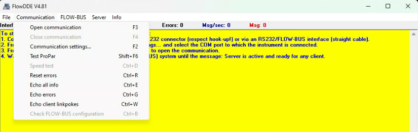
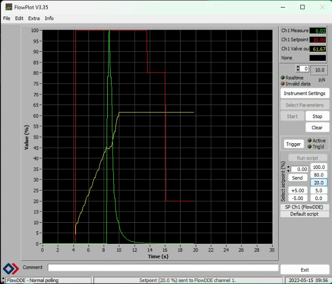
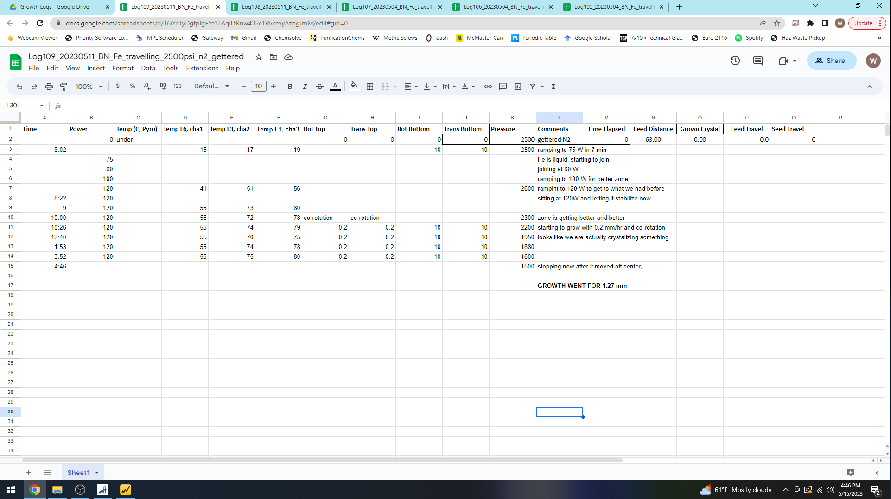
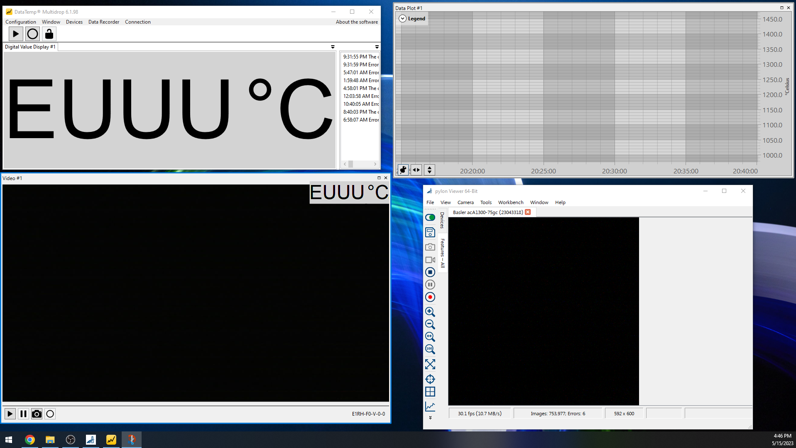
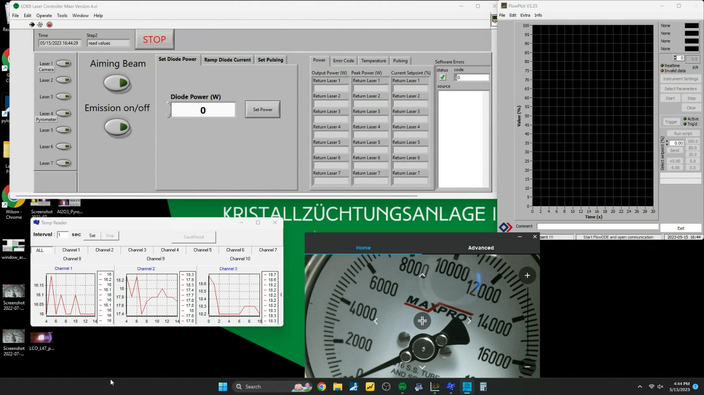

# Setting up the laser furnace (LOKII)

## Computers
LOKII is controlled by two PCs. ***Computer 1*** is mainly used for imaging, and ***Computer 2*** is mainly used for controlling the lasers. These computers should usually be left on, and require occasional restarts. Both are remotely accessible via Google Remote Desktop on the wilsonlabucsb Google account.

## Lasers
The seven laser units live in the server rack next to the furnace. In their "off" state, the key on the front of each unit is vertical. 

- Turn each unit on by turning each of the seven keys clockwise. 

Lasers are numbered 1-7, with numbers that correspond to each of the windows on the furnace chamber.

### Laser Controller Software
Each laser unit has a touchscreen that allows for full control of the laser, though we rarely use this feature and mainly control the lasers from ***Computer 2*** using a custom Laser Controller Software built in LabVIEW. 

- Start the software by clicking the LOKII logo (green heptagon), labled "LOKII Laser Controller Project".

!!! note
	The software should prompt for the creation of a logfile. Otherwise, the program is not communicating correctly with the lasers and must be restarted. When doing preparation steps, feel free to save a "dummy" logfile, usually called "test.txt".

## Translators
The translator control unit is located on the server rack, above the seven laser units. The translators are then controlled using a touchscreen monitor located to the right of Computer 2.

- Turn the translator unit on by flipping the red switch on the top right of the translator unit. The touchscreen monitor on the computer desk should begin turning on - if not, ensure that the monitor itself is powered on.

## Pyrometer
The [pyrometer](https://en.wikipedia.org/wiki/Pyrometer) is a remote-sensing thermometer that measures the temperature of the molten zone on the basis of its thermal radiation spectrum. The pyrometer is controlled via software on ***Computer 1*** called "DataTemp MultiDrop". The pyrometer is located on ***Window 4***.

- Open *DataTemp MultiDrop* software.
- Open an "Application Configuration", which loads the correct ethernet configuration as well as the previously used arrangement of data readout windows and data graphs used on the desktop.
- The temperature reading can be performed using 1-color or 2-color modes:

***Monochrome models (1-color) for standard temperature measurement applications***

The 1-color mode is best for measuring the temperature of targets in areas where no sighting obstructions, either 
solid or gaseous, exist. Such 1-color mode is also best where the target completely fills the measurement spot.

***Ratio models (2-color) for specific temperature measurement applications***

Ratio pyrometers determine the object temperature by the ratio of two separate and overlapping infrared bands. 
The 2-color mode is best for measuring the temperature of targets that are partially obscured, either intermittently 
or permanently by other objects, openings, screens, or viewing windows that reduce energy, and by dirt, smoke, 
or steam in the atmosphere. The 2-color mode can also be used on targets that do not completely fill the 
measurement spot, provided the background is much cooler than the target. Ratio pyrometers can measure and 
determine the object temperature in either one of both modes (1-color / 2-color), in which always 2 infrared 
detectors are active.

See the [manual from Fluke Process Instruments](https://assets.flukeprocessinstruments.com/FindIt/9250802_ENG_E_W.pdf) for more details.

## Camera
The camera is controlled by software on ***Computer 1*** called "Pylon Viewer".

- Open "Pylon Viewer"
- Open Window > Devices > Baseler acA1300.
- Click the "Continuous Shot" button to enable video feed. 
	
	!!! note
		The camera image is significantly darker than the pyrometer image when the furnace is not actively running.

- Open Window > Features - All > Acquisition Controls > Exposure Time. Use large values (100,000 ms) for setup and lower values (1,000 - 10,000 ms) during growth. 
	
	!!! note
		The frame rate will suffer greatly at high exposure times. It is recommended to use no higher than 100,000 ms, else the image will be "choppy". If the frame rate drops to 0 frames per second (fps), simply press "Stop" and "Continuous Shot" to restart video acquisition.

## Mass Flow Controller

The mass flow controller is controlled by two different programs on ***Computer 2***, called **FlowDDE** and **FlowPlot**. 

- Open FlowDDE and click Communication > Open communication.

- Open FlowPlot and click "Start".

- Use the "Select setpoint (%)" menu to set a flowrate. 100% corresponds to 10 standard liters per minute (SLM) of Ar flow. For other gases, there is a conversion factor [calculator available on the Bronkhorst website](https://www.fluidat.com/default.asp).

## Thermocouples

The thermocouples are read using a thermocouple reader box which is connected to ***Computer 2*** via USB connection.

- Open DP1001AM and click Setting > Port and set to COM6 (subject to change).
- Click "Connect" and all three thermocouples should provide a reading.

Each reading corresponds to a region of the chamber as follows:

- Channel 1: Window 6
- Channel 2: Window 3
- Channel 3: Window 1

These ports are all at different distances from the central chamber bore as specified in the [chamber drawings](https://drive.google.com/file/d/1bF2z0rJOU35PYmfswIMlTUs2nmuFOmcg/view?usp=share_link).

## Pressure Gauge Viewer

The pressure gauge at the outlet is monitored by a Logitech Webcam connected to ***Computer 2***.

- Open Logitech Software to view the camera.
- Physically adjust the webcam to capture at least the range 0 psi to 10,000 psi.

## Growth Logs

- Open the [Growth Logs](https://drive.google.com/drive/folders/1A3_43n8ItInI4Z7pf4uCt52mfkHWRzl-?usp=sharing) folder on Google Drive.
- Copy an existing log and maintain the naming scheme to keep files organized.
- See existing logs for examples - keep a good record of growth details. Images can also be included.

## Screen Recorder

Both computers are equipped with [OBS Studio](https://obsproject.com/), a free screen recording software.

- Open OBS Studio, and ensure that it is focused on the monitor you wish to record.
- Press "Start Recording".

## Typical Desktop Arrangement

***Computer 1 Left Desktop***

***Computer 1 Right Desktop***

***Computer 2 Desktop***
