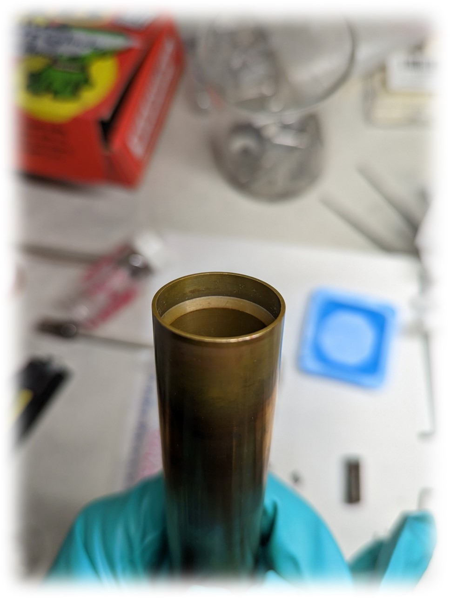

# Sealing the chamber

The translators are connected to the main chamber via inconel "adapter" pieces which use a replaceable metal-to-metal seal designed by [Destec Engineering Ltd.](https://www.destec.co.uk/). Drawings for the seal design can be found in the Laser Furnace Google Drive.

## Seal Rings

The inconel seal rings can be purchased from Destec, and are stored in their square cardboard boxes. Each ring is given a serial number written on the box to track the use of different rings and to identify which rings are no longer suitable for use at the highest pressures.

Each inconel seal ring is initially coated with a uniform layer of MoS$_2$. Upon sealing, both the MoS$_2$ coating and the inconel itself are damaged. Seal rings are not meant to be reused - the metal-to-metal seal causes some level of deformation in the inconel at the sealing surface. However, they have a high reusability at 1,000 psi and a much more limited reusability (2 to 5 sealings) at 10,000 psi.

After a ring has been used, the MoS$_2$ can optionally be re-coated using one of two techniques:

1. Pour some powdered MoS$_2$ into the seal ring box and shake by hand.
1. Uniformly spray coat the ring with MoS$_2$ spray in a fume hood.

## Heat and chemical shield (shroud)

{width="300" align="right"}

The volatilization of material during growth cannot be completely mitigated by the application of high pressure, warranting the use of a heat and chemical shield inside the chamber to protect the chamber walls and windows from material ejected out of the molten zone. This is accomplished using a copper-beryllium (CuBe) shroud which consists of a shroud cup, lower shroud piece, cylindrical window, and upper shroud piece.

## Assembling the shroud and loading the sample

1. Clean the top and bottom sealing surfaces using IPA/EtOH and a Kimwipe until the Kimwipe appears free of any residue.

1. Use an air duster to blow off the Kimwipe fibers off the sealing surface.

1. Gently place Destec sealing rings on the top face of the chamber and the top face of the lower translator.

1. **Shroud cup**: The shroud cup sits at the very bottom of the lower inconel adapter, and is meant to prevent material entering into the neck of the pressure tube of the lower translator. It is also useful for catching bits of crystals that have fallen down after growth. The cup has a hole in the center to allow the translator shaft to pass through it, and because this hole has a relatively large diameter a stainless steel collar is usually placed around the translator shaft just on top of the shroud cup to limit powder falling into this gap.

    

1. Place a collar and washer on the bottom translator shaft, about 5 mm below the notch meant to hold the seed rod. This washer is meant to catch falling debris.

1. Mount the seed rod holder using the bottom set screw.

1. **Lower shroud**: The lower shroud piece can be distinguished from the upper shroud piece because it has a ***sloped interior groove*** near the bottom end that mates with the top lip of the shroud cup. It is also slightly shorter than the upper shroud. Carefully place the lower shroud over the seed rod and down into the adapter to mate with the shroud cup. (It may be necessary to lower the seed rod in order to get the shroud over it.) 
    {width="300"}
1. There is a hole on the face of the shroud which should align with the gas outlet port on the chamber. Rotate the shroud until the hole is aligned.

1. **Cylindrical glass window**: The cylindrical glass window for LOKII is simply a glass tube that has been diced to the correct height. There is no anti-reflective coating and thus the windows are relatively inexpensive. These windows get damaged over time, especially when in contact with hot volatile material. 

    !!! danger
        There is a window specifically for LAPIS which is anti-reflection coated at 820 nm - **do not use this one with LOKII!** This AR-coated window has a visible coloration on the surface of the glass and is typically kept in a separate container. These are very expensive windows due to the cost of the coating (~>$1,000), so be very careful with them.

1. Carefully slide the lower translator housing upward until the inconel adapter is flush with the bottom face of the chamber.

    

1. **Upper shroud**: Similar to the lower shroud, except there is no sloped interior groove on the top end. This shroud piece also has a hole, which is meant to align with the inlet gas port on the chamber. ***Gently*** lower the upper shroud into the top opening of the chamber with the hole aligned, and the shroud will seat gently into the cylindrical glass window.

1. Mount a washer and collar onto the upper translator shaft, about 5 mm above the notched region.

1. Mount another washer and the upper half of the feed rod holder to the upper translator shaft, using the single set screw on the feed rod holder.

1. Slide the upper translator housing down until the adapter is flush with the top face of the chamber. Be cautious to not allow the feed rod to collide with the seed rod. It helps to lower the seed rod beforehand.

1. Check the alignment of the feed rod by rotating it in the beam. If not satisfactory, the alignment can be fixed by sliding up the upper translator housing and bending the inconel wire.

    Satisfactory alignment is more loosely defined for the feed rod than it is for the seed rod. Some precession is allowable, as the surface tension of the molten zone will keep the feed rod centered after joining the rods during growth.

    (Satisfactory alignment image)

## Sealing the Destec Clamps

The Destec clamps are sealed using a set of four bolts and eight nuts. The nuts and bolts should be assembled as in the following image, where the bolt is flush with the nut on one side of the clamp and protruding past the nut on the opposite side. 

The nuts have two distinct faces: one side is flat and dull with some text, while the other side is shiny and curved and plain. The shiny, curved side needs to be oriented to face the clamps, and the dull, flat, labeled side needs to face away from the clamp.

!!! tip
    It is recommended that the "flush" side be on the dominant-handed side of the user, as this is the side where the torque will need to be applied. 

(CLAMP IMAGE)

1. Pre-assemble the clamp as shown below:

1. Hold the clamps up to the chamber-translator interface and use two nuts to hold the clamp up.

1. Insert the remaining two bolts + nuts.

1. Gently tighten the four bolts until the clamps are parallel - this is determined visually and by approximately measuring the gap between the clamps using a finger.

1. Once the clamps are aligned, firmly tighten them by hand.

1. Obtain the 1-1/16" wrench and the torque wrench with 1-1/16" socket. Set the torque 23 ft-lbs.

(Image)

1. Tighten the first bolt a quarter-turn. If the position of the bolt does not allow for the full range of motion for a quarter turn, begin by placing the torque wrench at the "end" of the range of motion and then move it in reverse. 

- Considerations
    - Don't drop them
    - Don't mess up threads
- Using the torque wrench
- Tightening the clamps