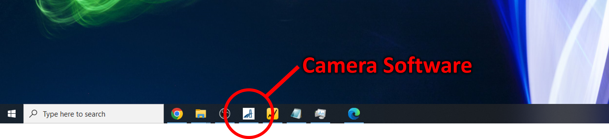
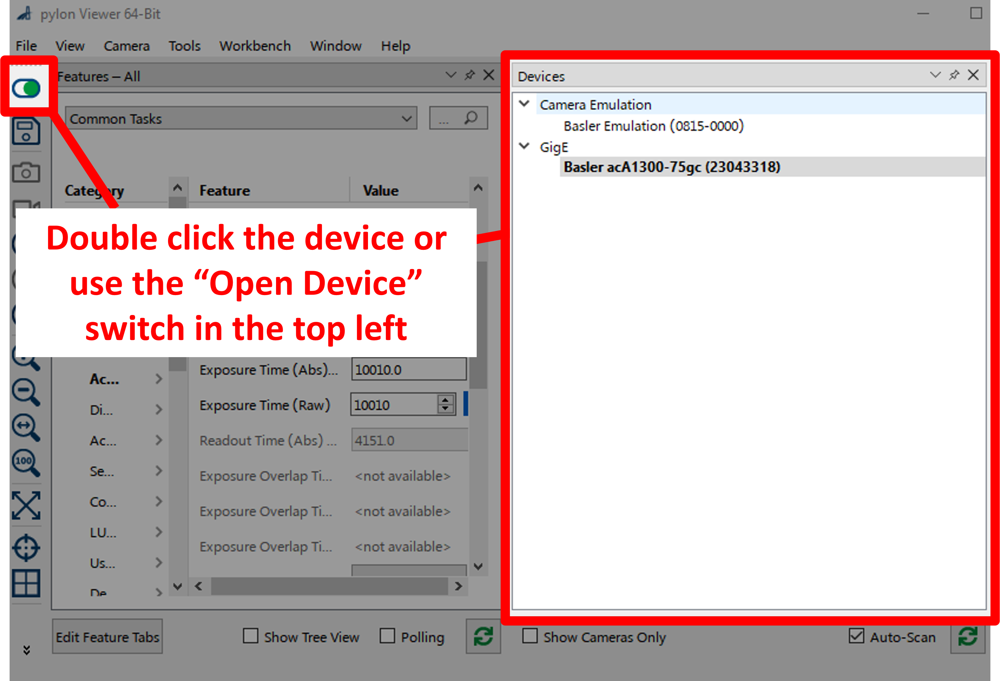

# Using the camera

## Section I: Using the camera software

1. The software "Pylon Viewer" is used to view live video feed from the camera. To open pylon viewer, click on the following icon (pinned to the Taskbar).

    

1. Once Pylon Viewer is open, navigate to `Window > Devices` to open the Devices menu.

    

1. To connect to the camera, double click `Basler acA1300-75gc`, or single-click then press the "Open Device" button in the top left. 

    

1. To obtain live video feed, click the "Continuous Shot" button on the main toolbar.
    
    

1. To adjust image settings, go to `Window > Features - All` to open the Features toolbar.

    

1. To adjust the exposure time, change the value found in `Acquisition Controls > Exposure Time (Abs)`. The maximum exposure time is typically 100,000 ms (when using aiming beam, for example), and the minimum is 100 ms (for a particularly bright growth).

    

## Section II: Adjusting the camera focusing optics

### To adjust brightness
To adjust the aperture (brightness) manually turn the front tab knob on the focusing optic attached to the camera. To further dim the brightness use a neutral density (ND) filter which you can slide into place.

### To adjust focus
Manually turn the outer knob on the focusing optic attached to the camera.

Recommended camera settings for aiming beam
---
- **Exposure Time (ms)** = 100,000
- **Filter** = No ND filter, shortpass filter optional
- Aiming beam on for lasers 2, 3, 5, 6, and 7. (Not lasers 1 and 4 where the camera and pyrometer are)

Recommended camera settings for infrared beam
---
- **Exposure Time (ms)** = 100 to 20,000
- **Filter** = ND1, ND2, or ND4 in place, in addition to shortpass filter.
