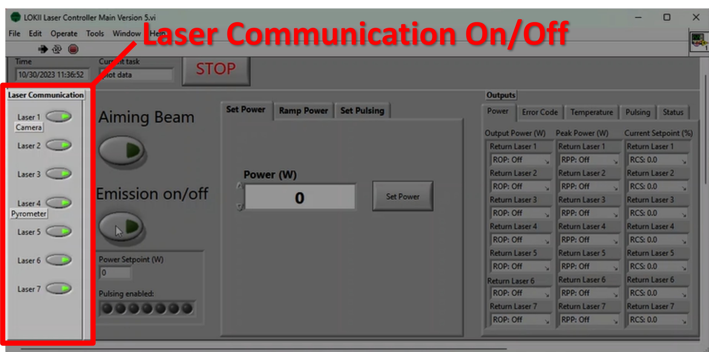
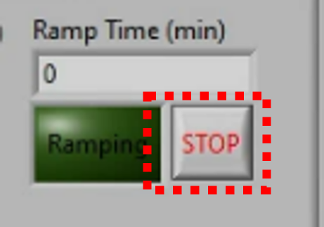

# Using the lasers

**Purpose**: To give users an overview of how to use the lasers during a typical growth. For more detailed information about the laser units (including binary commands, pinout diagrams, etc.) see the [IPG Laser User Guide](https://drive.google.com/drive/folders/1485noFCRa_4wWjhWcXW_ydtBLUo0RgD-?usp=drive_link).

---

## Section I: Startup

1. Turn the key on the front of each laser unit to the "ON" position. The touchscreen on each laser should turn on.
	
2. Click the "LOKII Laser Controller Project" on the taskbar.
   
1. The software should open and prompt for the creation of a logfile. 

	

	!!! warning
    	If the logfile prompt does not pop up, this means that the software is not communicating correctly with the lasers and must be restarted.

	When not being used for a growth, a dummy logfile "test.txt" can be used. For a growth, create a new logfile following the naming convention of previous files to keep files organized.
	
	*Example filename:* `"20230515_Log100_Sr2IrO4_growth50.txt"`
    
    - The `log` number is determined by the numbering of the logfiles in the [Growth Logs](https://drive.google.com/drive/folders/1A3_43n8ItInI4Z7pf4uCt52mfkHWRzl-?usp=drive_link) folder in the [LOKII Google Drive](https://drive.google.com/drive/folders/1-5bD7GNJCqUvJMFQOrpgeaQlDUMaeCdf?usp=drive_link).
    - The `growth` number is determined by how many times this material has been grown in the furnace.

---

### Basic LabVIEW working principles

The LabVIEW software is built to run in a continunous `while` loop, which only stops when the large red STOP ({width="50"}) button is pressed. The current step is indicated by the `Step` text box indicator on the top of the Laser Controller.

While understanding the function of each step in the while loop is not important for the general user, the details can be found in a later section. The important thing to understand is that ***your actions in LabVIEW are not put into effect until the loop has completed the next full cycle***. 

This results is some ***delays*** between, for example, when you click the `Aiming Beam` button and when the aiming beam actually turns on.

---

### Enabling communication with the lasers

On the left hand side of the Laser Controller, there are 7 buttons enabling communication with each of the laser units, shown here:

In the picture above, all lasers will receive commands as indicated by the illuminated green light on each button. When sending commands to a select few lasers, simply disable the corresponding button in this section.

---

### Using the aiming beam (visible red light)

For sample alignment, beam alignment, and beam focusing, the lasers offer a visible red laser light source called the "aiming beam". This radiation is visible, and is relatively low power. While delivering lower power than the infrared light, direct eye contact with the aiming beam can still cause injury.

To enable the aiming beam, enable communication with any of lasers 2, 3, 5, 6 or 7 and click the `Aiming Beam` button on the Laser Controller.

!!! warning
	Avoid using the aiming beam on lasers 1 and 4 - the semi-transparent mirrors in front of the camera and pyrometer are transparent to this red light and the aiming beam will obstruct viewing on windows 1 and 4.

---

### Using the infrared beam (1070 nm light)

For delivering heating power to a sample, use the infrared beam, which has a wavelength of 1070 nm and a maximum power output of 200 W. There are several steps to using the infrared beam.

1. Press the green `Start` button on the front of each laser unit to *arm* the lasers for emission. You will hear the cooling fans spin up on each unit. This does not mean laser light is being emitted at this point, but laser goggles and curtains should be used at all times when the lasers are in this state (see [Laser Safety](#1-laser-safety)).
1. Ensure that the proper filtering optics are in place:
	- Notch filter (1064 nm) in front of the pyrometer
	
	- Short pass filter in front of the camera
	- If needed, a neutral density filter (options: ND1, ND2, ND4) to dim the image in front of the camera as well.
	
1. Click `Emission On`. You should see the orange LED bar on the front of each laser unit flash three times and stay illuminated. ***This means that the infrared beam is emitting light - be cautious.***

	

---

### Setting the laser output power

Three tabs **Set Power, Ramp Power, and Set Pulsing** in the center of the laser controller are used as inputs to control the laser output power.

#### Manually set a power

Using the **Set Power** tab, enter a power in the `Power (W)` input field, and press the `Set Power` button to set the power.

!!! warning
	This only sets the power for the lasers for which `Laser Communication` is enabled. The power setpoint for the other lasers will remain unmodified in this case.

---

#### Automatic power ramping

1. Using the **Ramp Power** tab, enter the desired power setpoint in the `Target Power (W)` field and a ramp rate (1 W/min is a safe value to start) in the `Ramp Rate (W/min)` field.

1. Click `Calculate Ramp` to set the values and calculate a `Ramp Time (min)` displayed in the top right.

1. With `Emission on/off` set to on, click `Ramp!` to begin ramping the power to the desired setpoint. The graph below shows the average output power among the seven lasers. The green `Ramping` indicator under the `Ramp Time (min)` indicator illuminates to bright green.

1. To stop the ramp, click the small `STOP` button to the right of the `Ramping` indicator. This pauses the ramp at the current setpoint.

	{width="200"}

1. Optionally, you may change the target power or the ramp rate when the ramp is stopped - to do so, simply enter new values and click the `Calculate Ramp` button to save these changes.

1. To resume the ramp, click the `Ramp!` button.

1. Once the setpoint reaches the target power, the ramp will stop automatically.

---

#### Laser pulsing

The laser units are equipped with an internal pulsing control which allows the beam to pulse at a chosen frequency with chosen pulse width. These are set using the **Set Pulsing** tab. 

In order for pulsing mode to actually emit light, a constant DC signal must be applied to terminals on the back of each laser unit. To accomplish this, a simple DC power supply rests near the top of the server rack. To enable, simply turn on the power switch on the left hand side of the DC Power Supply unit, and then send the DC signal by pressing the blue `Output On/Off` button on the front panel of the unit.

Set a desired pulse width in ms by entering a value in the `Pulse Width (ms)` field and click `Set Pulse Width`. Click `Pulsing on/off` to enable the pulsing mode on the lasers - the `Pulsing enabled:` indicators near the lower left of the Laser Controller should glow orange for each laser (1 through 7) which has pulsing enabled.

The default pulse frequency or **Pulse Repetition Rate (Hz)** as labeled in the Laser Controller software is 100 Hz - meaning that 100 pulses occur per second, equivalent to one pulse every 10 ms.

The [duty cycle](https://en.wikipedia.org/wiki/Duty_cycle) is then controlled exclusively by the pulse width, meaning that a pulse with of 5 ms corresponds to a duty cycle = 50% as shown below. In the default configuration, the duty cycle can be calculated using the forumla $\rm{Duty} = \rm{Width}/10~\rm{ms} \times 100\%$.

{width="200"}

### Understanding the outputs / logfile

---

## Laser components
Each fiber laser consists of a control unit, a fiber optic cable, and collimating optics. Each laser emits a wavelength of 1070 nm and is capable of reaching 200 W of highly collimated infrared light. This totals a whopping 1400 W of laser power, and just a few milliwatts can start a fire. The light is invisible, and thus can be incredibly dangerous. It is important to prioritize laser safety when working with these furnaces.

***Some quick do's and don'ts:***
!!! danger
	- Do not bend the fiber optic cable, it is very fragile and has a minimum curvature that it can withstand.
	- Do not allow any dust or dirt to obstruct the output of the laser optics. These particles can burn or melt the optics themselves.

## Laser optics
### Anti-reflection coatings
### Focusing optics
### In-plane viewing optics

---

## Laser safety
There are several key components of laser safety in the Laser Lab.

- Firstly, the optics should always keep the beam in an enclosed space, such that minimal free laser light is able to leave the lens tubes and/or chamber.

- Secondly, the laser curtains should always be (***closed***) when the lasers are armed to emit any infrared light. This is evidenced by the green "Start" button being illuminated on the front housing of each laser unit. This does not necessarily mean they *are* emitting any infrared light - emission is indicated by the large orange LED bar on the front of each laser unit.

- Similarly, whenever the laser units are armed, occupants of the lab should be wearing laser safety goggles with optical density (OD) 6+ at 1070 nm. These are not strictly required when the laser curtains are closed but should certainly be worn at all times when the curtain is open and the lasers are armed (regardless of whether emission is on).

### Using the Laser Unit Touchscreens

The touchscreen on the front of the laser units should be used sparingly, only for basic or absolutely necessary tasks such as turning on the aiming beam, enabling/disabling pulsing ("Gate Mode"), and for urgent needs to turn off emission / emergency shutoff.

