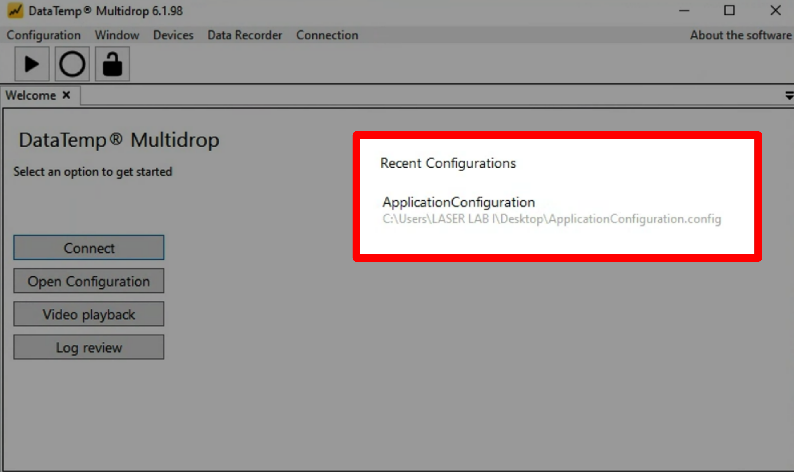
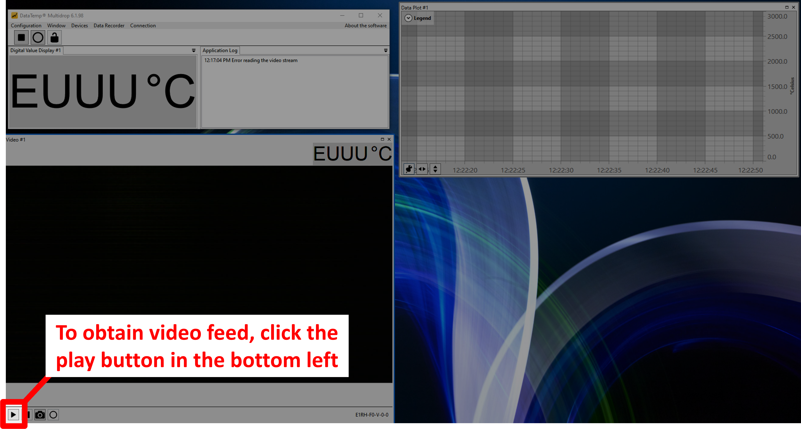
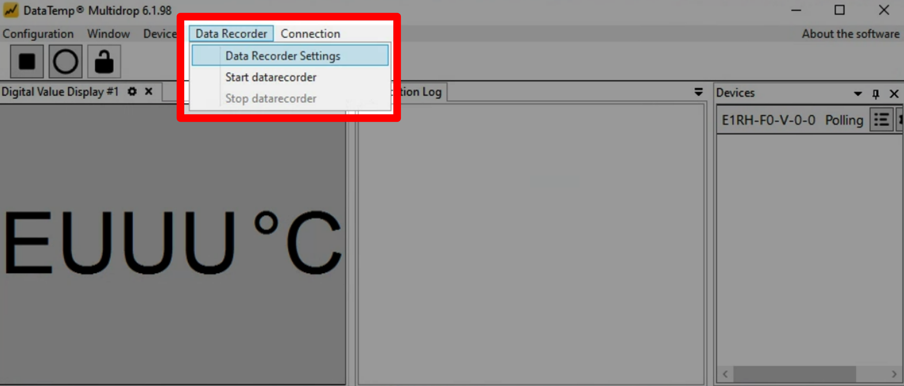
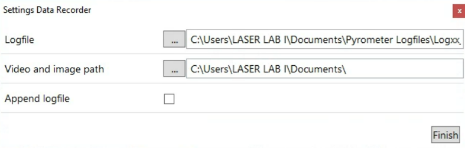
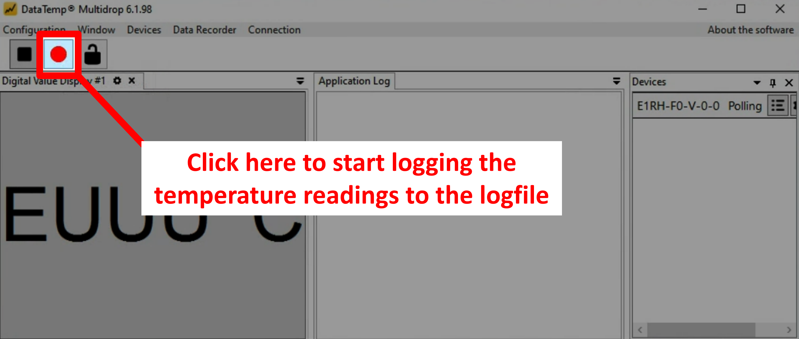
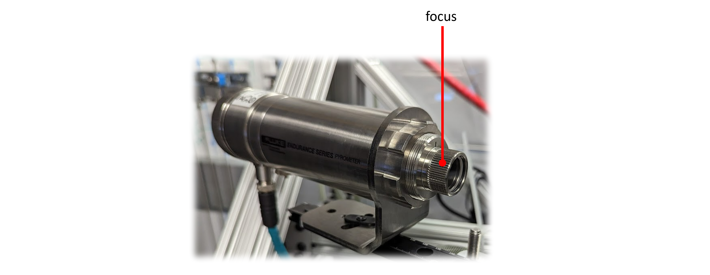

# Using the pyrometer

## Section I: Using the pyrometer software
1. The software "DataTemp MultiDrop" is used to view the video feed and get pyrometry (temperature) readings. To open DataTemp MultiDrop, click on the following icon (pinned to the Taskbar).

    

2. Open an "Application Configuration", which stores the settings previously used by DataTemp MultiDrop. These include the window layout, plot formatting, and pyrometery methods (e.g., 1-color vs. 2-color modes).

    

3. To obtain a live video feed, click the "Play" button in the lower left hand corner of the video panel.

    

4. To set up the Data Recorder, navigate to `Data Recorder > Data Recorder Settings`.
   
    

5. Update the name of the logfile using the `...` to the left of the filepath. Check the "Append logfile" box to ensure that the logfile is not overwritten if logging stops and then restarts.

    

6. To start the Data Recorder, click the "Start Data Recorder" button in the top left of the main panel of the software.

    

## Section II: Adjusting the pyrometer optics
    
### To adjust the focus

Turn the knob on the front of the pyrometer housing.

   

!!! note
    The pyrometer brightness / exposure time is automatically controlled by the pyrometer software, it cannot be manually adjusted.

## Recommended imaging settings for aiming beam:
- **Filter** = No notch filter

## Recommended imaging settings for infrared beam:
- **Filter** = Notch filter ([NF1064-44](https://www.thorlabs.com/thorproduct.cfm?partnumber=NF1064-44)) in place