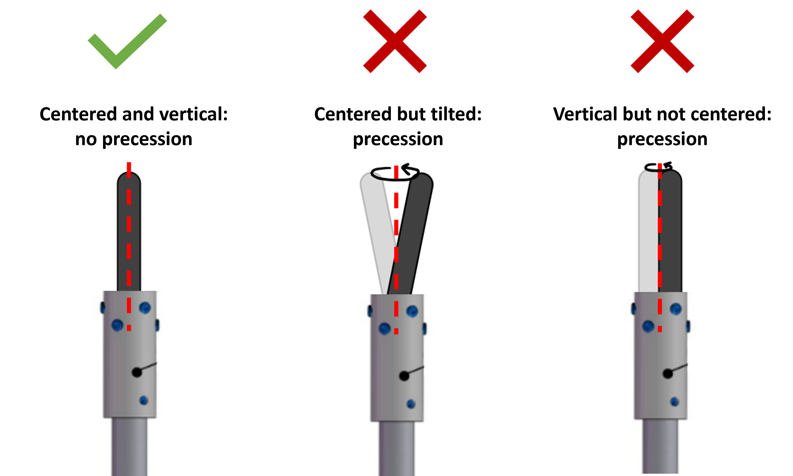

# Mounting and aliging sample
## Section I: Mounting the seed rod

1. Insert the six mounting set screws at the top of the seed rod holder, enough so that they are flush with the inner cylindrical surface.

1. Place the seed rod into the seed rod holder and tighten the bottom three mounting set screws in equal increments (~1/4 turns).
	- Care should be taken to keep the sample centered within the mount, though slight tilts are allowable at this point and may be corrected in the next step, using the other three mounting set screws.
	- The bottom of the seed rod must be above the interior ledge within the seed rod holder. This ledge rests atop the translator shaft - otherwise the seed rod itself will collide with the translator shaft first, and this can cause damage to the seed rod.
1. Tighten the top three set screws until they are gently touching the seed rod. These will be used to optimize the sample tilt, such that there is no precession about the central axis when it rotates.

## Section II: Aligning the seed rod

Assess and correct the precession of the seed rod - this can be done in any way you see fit, but the following technique is recommended:

1. Place the seed rod holder onto the bottom translator shaft and attach using the single set screw on the bottom of the seed rod holder.
1. Slide the bottom translator housing up towards the chamber.
1. Turn the aiming beam on for all lasers except lasers 1 and 4.
1. With rotation enabled, use the `Fast Gear` to translate the **tip of the seed rod** into the beam.
1. Allow the sample to rotate in the beam and use tape to mark the maximum leftward and rightward positions of the seed rod.
	
1. Stop the rotation at the moment when the rod is at the rightmost (or leftmost) position.
1. Slide the bottom translator housing down so that the sample is accessible.
1. Identify the direction in which the rod is tilted, based on whether it was at the rightmost or leftmost extreme. ***Keep track of this direction as you remove the sample from the shaft.***
1. Gently **loosen** the screws opposite the direction of the unwanted displacement, and then gently **tighten** the screws that lie along the direction of the unwanted displacement to remedy it.
	
1. Replace the seed rod onto the shaft and repeat until precession at the tip of the rod has been eliminated.

## Section III: Mounting the feed rod

The feed rod is mounted in essentially the same manner as the seed rod.
However, the standard for minimizing precession using the mounting set screws is not as critical here, as minor adjustments can be made by manipulating the bend of the wire connecting the two holder pieces.

**Measure the length of the feed rod** and record this length in the [Growth Log](https://drive.google.com/drive/folders/1A3_43n8ItInI4Z7pf4uCt52mfkHWRzl-?usp=drive_link) before continuing. End the growth ~7 mm before the beam reaches the sample holder.

## Section IV: Aligning the feed rod

1. With the feed rod holder (upper) mounted to the upper translator shaft, manipulate and bend the wire such that the feed rod is straight and centered to the eye.

1. Slide the upper translator downwards until it reaches the chamber. Be careful not to collide the feed rod into the seed rod. With rotation enabled on the top translator, use the fast gear to move the feed rod into the aiming beam.

1. Use tape to mark the extrema of the precession of the feed rod.
	

1. Slide the upper translator upwards until the feed rod is accessible. Manipulate and bend the wire until the alignment is improved. Repeat until alignment is satisfactory, as shown below.
	