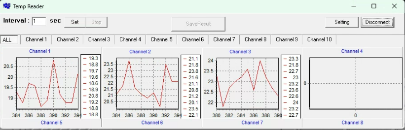
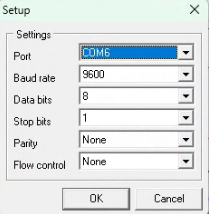

# Using the thermocouples

[Work in progress]

The thermocouples are connected to PC1, via an Omega brand thermocouple readout box. The box is mounted on the furnace, and should have three thermocouples wired to channels 1, 2, and 3 on its back. The box has a power button on the front panel which can be manually turned on.

Each of the three thermocouples should be mounted in one of the thermocouple ports on the chamber:
- Channel 1 --> Window 6
- Channel 2 --> Window 3
- Channel 3 --> Window 1

To open the thermocouple software, use PC1 to open "DP1001AM" which provides a signal readout from the thermocouple box. The thermocouple box should be connected to the PC via a USB-A cable.

In the top right of the software, there should be a button labeled "Setting" and one labeled either "Connect" or "Disconnect". If you don't see these buttons, try resizing the window - they tend to get hidden if the window is too small when the software is initially opened. Click on the "Setting" button and make sure the correct "COM" port is selected. At the time of writing this SOP, it is COM6, though the specific COM port may change if the thermocouples are re-installed at a later time.

Historically, a temperature reading above 100 °C is considered concerning, as this would cause melting of the O-rings in the windows on the old LAPIS furnace design. With the new LOKII furnace design, the cooling power should be substantially improved and the chamber should theoretically be able to withstand temperatures over 100 °C, though the upper limit has not been determined as of yet.

!!! warning
    The temperature readings can be systematically off due to electromagnetic interference from the translator cables, particularly at room temperature.