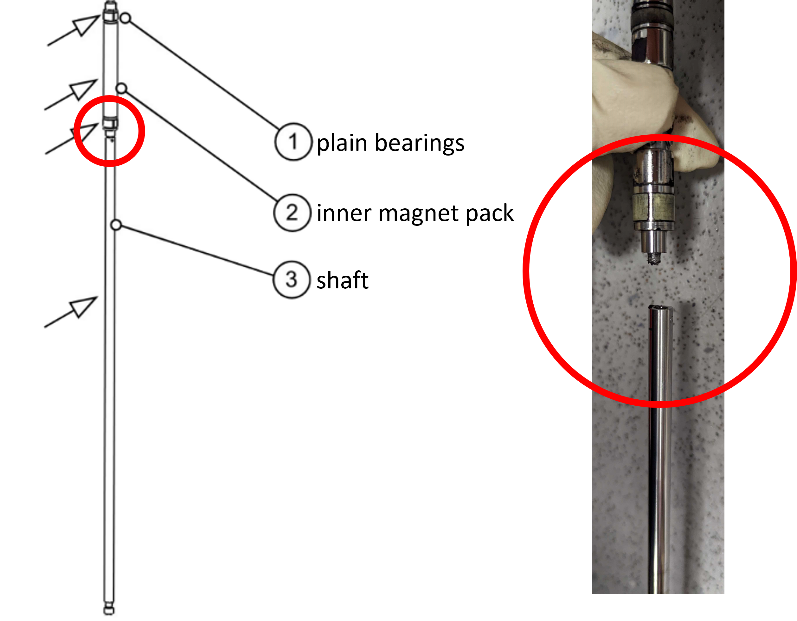

# Translator Control

## Translator Design

---

## Raising and lowering the translator housings

### Counterweight system

Each translator is quite heavy, and sliding it up and down on the furnace framing is facilitated by iron counterweights which attach the translators via a cable-pulley system. Each counterweight is equipped with a so-called "handbrake" which can be tightened to lock its position.

### Where and where not to grab

{width="400"}

---

## Using the translator touchscreen

!!! warning
    There are **several important considerations** when using the translators:

    1. Never allow the translators to reach their maximum translation limits. There are limit switches to automatically stop translation once these limits are reached, but they are not guaranteed to work and failure here can cause costly damage to the translator units.

    1. The translators should never translate without rotation enabled.

    1. Always MODIFY the automatic translation speed before enabling slow automatic translation - there is a software error that can lead to accidental fast translation if the speed has remained unmodified for an extended period of time. Specifically, we suspect that this occurs only after the **2-finger automatic fast gear mode** (see below) has been used and the automatic translation speed has not been changed since this mode.

The translators are controlled entirely via the touchscreen monitor next to the computers. Each of the buttons is used by tapping once, with the exception of the `Fast Gear` fast translation buttons which must be held down constantly.

---

## Sample rotation

To enable rotation, simply tap the CW or CCW buttons and the shaft will begin to rotate. The default speed is 10 revolutions per minute, which can be adjusted by adding or subtracting values using the +/- buttons under the rpm readout. 

!!! warning
    ***It is recommended to avoid using the +/- 10 rpm buttons***, as these can cause decoupling of the magnet pack and/or failure of the rotation motor.

### RPM limits

There are two generations of translator units - the first generation has slightly thinner diameter lead screw and keyed shaft. These older models are thought to have an upper limit of 15 rpm, above which the rotation motor may not operate continuously. The second generation, having thicker lead screw and keyed shaft, has been demonstrated to work at speeds up to 30 rpm.

--- 

## Sample translation

### Fast Manual Translation

To use fast manual translation, with rotation enabled, simply long-press the `Fast Gear` up/down arrows and the shaft will translate as long as the button is held down.

!!! tip
    **2-finger automatic fast gear mode**

    To long-press the `Fast Gear` buttons without needing to keep your finger on the screen, you may use a 1-finger press on the button followed by adding a second finger nearby on the screen, followed by releasing both fingers at the same time. Be cautious to not allow the fast gear to take the translator motors to their extreme limits - keep watch of the translators in this mode and tap the button again to disable.

### Slow Automatic Translation

To use slow automatic translation, set a translation speed in mm/hr using the +/- buttons under the speed readout. *See warning at the top of this page about errors that can cause the software to accidentally ignore this speed and "fast move".*

Then, with rotation enabled, tap the `Automatic` up/down buttons to begin translation.

## Other considerations
    
### Changing pressure too quickly

Changing the pressure too quickly can violently force the translator shaft in or out of the pressure tube, decoupling it from the magnet pack and potentially damaging equipment / samples. Always pressurizing and depressurize slowly to avoid this.

### Mechanical failure points

**Snapped shaft**
The most catastrophic failure has been mechanical failure of the attachment between the shaft and the inner magnet back at its base. The shaft is weakly attached here and even gentle torquing of the shaft can cause failure over time.

{width="500"}

**Friction in bearings**
The translators don't have any sort of lubrication. The shaft is meant to simply glide about some plain bearings made of white plastic (Teflon?). These bearings quickly become contaminated with volatilized powder from various growths, and the translator shafts will start to squeak and vibrate as a result. Cleaning this requires opening up the translators which is quite tedious and labor and time intensive - and can be costly if done incorrectly - thus, we tend to live with such vibrations until it is absolutely necessary to replace / clean the bearings. See the Maintenance section for more information.

