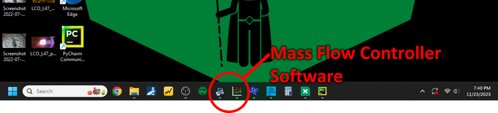

# Startup guide
**Purpose**: A reference to be used *each and every time* by experienced users of the furnace.

1. Create a new Growth Log in the "[Growth Logs](https://drive.google.com/drive/folders/1A3_43n8ItInI4Z7pf4uCt52mfkHWRzl-?usp=drive_link)" folder in the [LOKII Google Drive](https://drive.google.com/drive/folders/1-5bD7GNJCqUvJMFQOrpgeaQlDUMaeCdf?usp=drive_link).    

1. On the front of each of the seven laser units, turn the key clockwise to the "ON" position.
    {width=400}

1. On the front of the translator control unit, flip the power switch on the top right.
   

1. On Computer 1, open the camera software, Pylon Viewer ([more info]())
   

1. On Computer 1, open the pyrometer software, DataTemp MultiDrop ([more info]())
   

1. On Computer 2, open the thermocouple software, DP1001 AM ([more info]())
   

1. On Computer 2, open the Laser Controller Software ([more info]())
   

1. On Computer 2, open the webcam software to monitor the pressure gauge, Logitech Camera Settings ([more info]())
   

1. On Computer 2, open the mass flow controller software, FlowDDE and FlowPlot ([more info]())
   

    Slide bottom translator down

    Place shroud cup with collar

    Place bottom seal ring

    Attach collar to shaft 2 cm from tip

    Add alumina washer on top of collar

    Mount seed rod in seed rod holder (can be link)

    Mount seed rod holder on bottom translator shaft

    Install lower shroud, groove down, hole to gas

    Install shroud window

    Raise bottom translator housing

    Place top seal ring

    Carefully lower top shroud into chamber until it rests on glass shroud window

    Mount feed rod in feed rod holder (see link)

    Measure length of mounted feed rod and record in Growth Log

    Attach washer and collar to upper translator shaft 2 cm from tip

    Attach washer and feed rod holder to upper translator shaft

    Slide upper translator down, careful not to collide the rods

    Seal lower and upper clamps to 23 ft-lbs (see link)

    Close chamber outlet valves (ball then needle)

    Open chamber inlet valves (ball then needle)

    Pressurize chamber (see link)

    If static pressure, close inlet valves

    Bring feed and seed to starting positions

    Focus and align camera and pyrometer

    Place filtering optics in place (see link)

    Hang laser safety sign on door

    Put on laser safety goggles

    Close laser curtains

    Press green "Start" button on each laser to enable emission (see link)

    Enable communication with all seven lasers from controller software

    Begin logging pyrometer readings (see link)

    Begin recording screens (see link)

    Begin growth! (see link)
